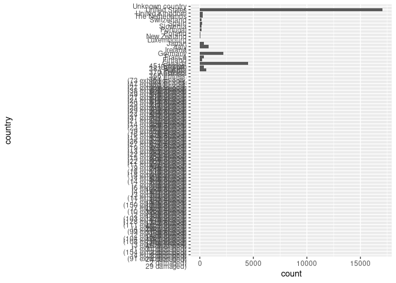
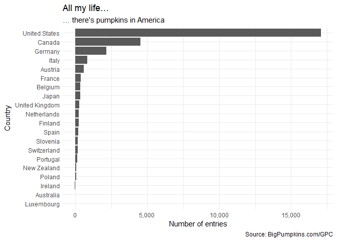
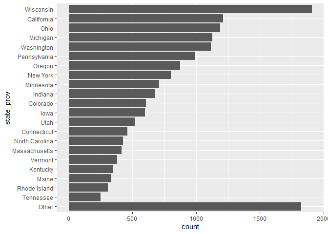
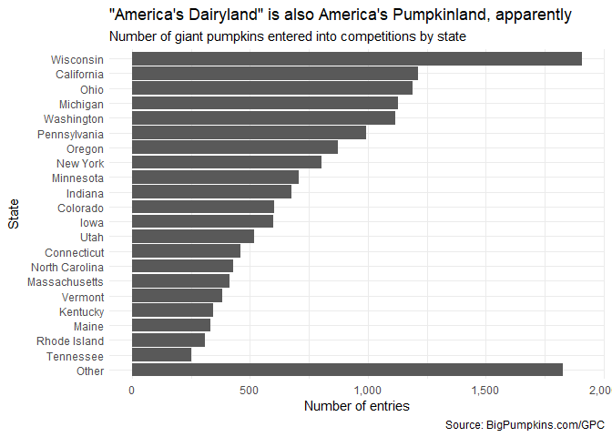
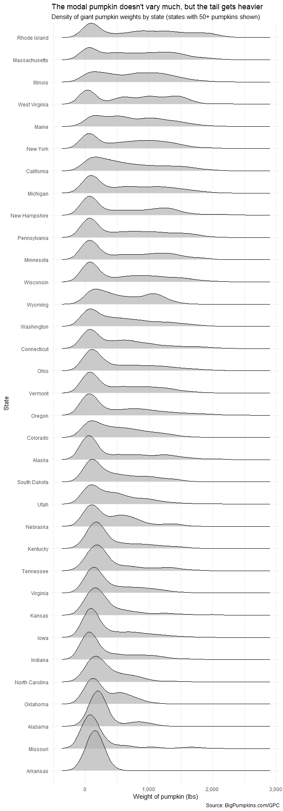
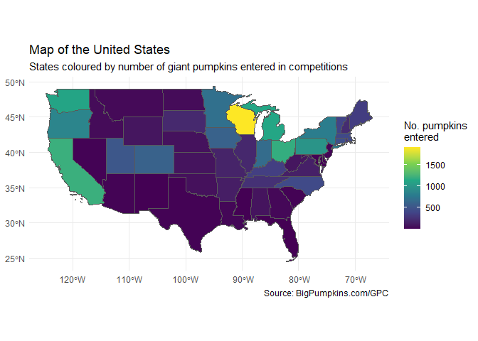

Code-along, Week 05: Big Pumpkins
================
Alex Homer
21 October 2021

``` r
library(tidyverse)
library(here)
library(scales)
library(ggridges)
library(sf)
library(morecats)
#This package is one maintained by me.  To install it if necessary, make sure
#`devtools` is installed, then run
# devtools::install_github("AlexJHomer/morecats")
#For projects created from 22nd October 2021, this should be already installed
#if you're working in the course space on RStudio Cloud

#This document also requires the `emo` package, for emoji.  To install it if
#necessary, make sure `devtools` is installed, then run
# devtools::install_github("hadley/emo")
#For projects created from 16th October 2021, this should be already installed
#if you're working in the course space on RStudio Cloud
```

## Read data

The data are drawn from the “Tidy Tuesday” project: [2021 Week 43: Big
Pumpkins](https://github.com/rfordatascience/tidytuesday/blob/master/data/2021/2021-10-19/readme.md)
(credit:
[BigPumpkins.com](http://www.bigpumpkins.com/ViewArticle.asp?id=132),
providing data from the [Great Pumpkin
Commonwealth](https://gpc1.org/)).

``` r
pumpkins <- read_csv(
  "https://raw.githubusercontent.com/rfordatascience/tidytuesday/master/data/2021/2021-10-19/pumpkins.csv"
)
```

## Which countries?

Let’s find out which countries submit the most entries to these
competitions. Our first attempt at making a bar graph will… not look
good! But it will give us some information about the data.

``` r
pumpkins %>%
  ggplot(aes(y = country)) +
  geom_bar()
```

<!-- -->

Yikes. Firstly, there seem to be a lot of nonsense “countries” which
begin either with numbers or with brackets, which we can inspect by
running the code below in R itself (it’s set not to evaluate in this
document).

``` r
pumpkins %>%
  filter(!str_detect(country, "^[[:alpha:]]")) %>%
  #Finds countries that don't start with a letter %>%
  View()
```

These rows just have the same thing repeated, which appears to be some
sort of incorrectly-parsed header row. They all begin with digits, so we
can exclude such “countries” when we clean the dataset.

We can also notice by using the `glimpse` function…

``` r
glimpse(pumpkins)
```

    ## Rows: 28,065
    ## Columns: 14
    ## $ id                <chr> "2013-F", "2013-F", "2013-F", "2013-F", "2013-F", "2~
    ## $ place             <chr> "1", "2", "3", "4", "5", "5", "7", "8", "9", "10", "~
    ## $ weight_lbs        <chr> "154.50", "146.50", "145.00", "140.80", "139.00", "1~
    ## $ grower_name       <chr> "Ellenbecker, Todd & Sequoia", "Razo, Steve", "Ellen~
    ## $ city              <chr> "Gleason", "New Middletown", "Glenson", "Combined Lo~
    ## $ state_prov        <chr> "Wisconsin", "Ohio", "Wisconsin", "Wisconsin", "Wisc~
    ## $ country           <chr> "United States", "United States", "United States", "~
    ## $ gpc_site          <chr> "Nekoosa Giant Pumpkin Fest", "Ohio Valley Giant Pum~
    ## $ seed_mother       <chr> "209 Werner", "150.5 Snyder", "209 Werner", "109 Mar~
    ## $ pollinator_father <chr> "Self", NA, "103 Mackinnon", "209 Werner '12", "open~
    ## $ ott               <chr> "184.0", "194.0", "177.0", "194.0", "0.0", "190.0", ~
    ## $ est_weight        <chr> "129.00", "151.00", "115.00", "151.00", "0.00", "141~
    ## $ pct_chart         <chr> "20.0", "-3.0", "26.0", "-7.0", "0.0", "-1.0", "-4.0~
    ## $ variety           <chr> NA, NA, NA, NA, NA, NA, NA, NA, NA, NA, NA, NA, NA, ~

…that some of the numeric columns have been parsed as character, because
when `readr` was reading in the data they still had the text strings in
them. We need to change those to numeric, and we should use the
`parse_number` function from `readr` to do this because it handles the
thousands-separating commas nicely [1] (whereas base R’s `as.numeric`
function produces `NA`s for these).

There are a couple of other changes we might like to make: “Unknown
country” would be handled more sensibly by R if we had that as `NA`, and
typicaly datasets call the country north of Belgium and west of Germany
“Netherlands” instead of “The Netherlands”.

``` r
pumpkins_cleaned <- pumpkins %>%
  filter(!str_detect(country, "^\\d")) %>%
  #Removes country names that start with a digit
  mutate(
    country = case_when(
      country == "Unknown country" ~ NA_character_,
      #`NA` here produces an error!
      country == "The Netherlands" ~ "Netherlands",
      TRUE                         ~ country
    ),
    weight_lbs = parse_number(weight_lbs),
    ott = parse_number(ott),
    est_weight = parse_number(est_weight),
    pct_chart = parse_number(pct_chart)
  ) 
```

Right, let’s have another go at that bar chart.

``` r
pumpkins_cleaned %>%
  filter(!is.na(country)) %>%
  mutate(
    country = country %>%
      fct_infreq() %>%
      fct_rev()
  ) %>%
  ggplot(aes(y = country)) +
  geom_bar() +
  labs(
    x = "Number of entries",
    y = "Country",
    title = "All my life…",
    subtitle = "… there's pumpkins in America",
    caption = "Source: BigPumpkins.com/GPC"
  ) +
  scale_x_continuous(labels = comma) +
  #This is the `comma` function from the `scales` package.
  #We could also write
  # scale_x_continuous(labels = label_comma()) +
  #which more easily lets us set any further options, should we wish to
  theme_minimal() +
  theme(axis.title.y = element_text(margin = margin(r = 6))) #Nudge label left
```

<!-- -->

💡 *What happens if we swap the last two lines of code around? (Taking
care to put the plus in the right place, of course.) What does this tell
us about the interaction between `theme_minimal` and `theme`?* 💡

There’s a subtlety above in whether you put the brackets after the end
of the function name in the `labels` argument. It’s a bit technical, so
it might be easier just to remember when you do and don’t have to use
it, but if you’re interested the rationale is in a footnote [2].

Seems like the US is the prime country for the growing of these
pumpkins. But which states? Let’s find out.

## Which states?

All fifty states are represented in this dataset.

``` r
pumpkins_usa <- pumpkins_cleaned %>% #Remember to use the cleaned dataset!
  filter(country == "United States")

pumpkins_usa %>%
  summarise(num_states = n_distinct(state_prov))
```

    ## # A tibble: 1 x 1
    ##   num_states
    ##        <int>
    ## 1         50

So that’s going to be too many to comfortably show on our graph—the
`fct_lump` functions are useful for this.

``` r
pumpkins_usa %>%
  mutate(
    state_prov = state_prov %>%
      fct_infreq() %>%
      fct_lump_n(n = 21) %>%
      fct_rev()
  ) %>%
  ggplot(aes(y = state_prov)) +
  geom_bar() +
  labs(
    x = "Number of entries",
    y = "State",
    title = "\"America's Dairyland\" is also America's Pumpkinland, apparently",
    subtitle = "Number of giant pumpkins entered into competitions by state",
    caption = "Source: BigPumpkins.com/GPC"
  ) +
  scale_x_continuous(labels = comma) +
  theme_minimal() +
  theme(axis.title.y = element_text(margin = margin(r = 6))) #Nudge label left
```

<!-- -->

How I got here… I first tried `fct_lump_lowfreq`, which lumps together
the least frequent variables such that the “Other” category is still
smallest. Unfortunately, that lumps together very little.

``` r
pumpkins_usa %>%
  mutate(state_prov = fct_lump_lowfreq(state_prov)) %>%
  summarise(n_values = n_distinct(state_prov))
```

    ## # A tibble: 1 x 1
    ##   n_values
    ##      <int>
    ## 1       50

In fact, it lumps together absolutely nothing.

What I wanted was for the “Other” category to at least be smaller than
the *largest* value. There’s no function in `forcats` for this. So I
used `fct_lump_n`, which lets me specify how many levels get kept
separate; then I could find the right value of `n` by trial and error.

But it annoyed me that this function didn’t exist, so I went into the
`forcats` source code, modified it to make a function that did what I
want [3], and put it on GitHub (I called it `morecats`). This then
provides a function called `fct_lump_lowfreq2`, which does exactly this.

``` r
pumpkins_usa %>%
  mutate(
    state_prov = state_prov %>%
      fct_infreq() %>%
      fct_lump_lowfreq2() %>% #From `morecats`
      fct_rev()
  ) %>%
  ggplot(aes(y = state_prov)) +
  geom_bar() +
  labs(
    x = "Number of entries",
    y = "State",
    title = "\"America's Dairyland\" is also America's Pumpkinland, apparently",
    subtitle = "Number of giant pumpkins entered into competitions by state",
    caption = "Source: BigPumpkins.com/GPC"
  ) +
  scale_x_continuous(labels = comma) +
  theme_minimal() +
  theme(axis.title.y = element_text(margin = margin(r = 6))) #Nudge label left
```

<!-- -->

## Weight of pumpkins

Let’s look at the distribution of the weight of pumpkins. We can do a
density plot for this, but it’s not very meaningful if you only have a
few data points for a given state. So we’ll filter out the states
without many pumpkins. We’ll then do a ridge plot, sorting the states by
their mean pumpkin weight.

``` r
large_states <- pumpkins_usa %>%
  group_by(state_prov) %>%
  summarise(
    mean_wt = mean(weight_lbs, na.rm = TRUE),
    n = n()
  ) %>%
  filter(n >= 50) %>%
  pull(state_prov)

pumpkins_usa %>%
  filter(state_prov %in% large_states) %>%
  mutate(
    state_prov = state_prov %>%
      fct_reorder(weight_lbs, mean)
  ) %>%
  ggplot(aes(x = weight_lbs, y = state_prov)) +
  geom_density_ridges(alpha = 0.7) +
  labs(
    x = "Weight of pumpkin (lbs)",
    y = "State",
    title = "The modal pumpkin doesn't vary much, but the tail gets heavier",
    subtitle = "Density of giant pumpkin weights by state (states with 50+ pumpkins shown)",
    caption = "Source: BigPumpkins.com/GPC"
  )
```

    ## Picking joint bandwidth of 123

<!-- -->

As the subtitle says, it seems like all states have a similar
concentration of pumpkin weights in these competitions, but the most
successful states on average have a few outlying large pumpkins.

💡 *What would happen if we sorted by median weight?* 💡

💡 *We didn’t have time to do this in the Code-Along, but the dataset has
both estimated and measured pumpkin weights in it. Are there any
analyses we could do on this, to see how good the esimation is?* 💡

## Mapping the pumpkins

One thing that’s really easy to do in R with the right packages is make
maps, so I thought I’d show you how to do that in case it’s useful for
your projects. The package `sf` is useful for this.

You also need a shape file for the map you want to produce. There’s one
in the data folder, which we can read with `geom_sf`.

``` r
states_sf <- read_sf("data/cb_2018_us_state_20m.shp")
```

Let’s now make a map showing how many pumpkins were entered in each
state. Plotting maps across the 180° line of longitude is hard, so lets
remove Alaska and Hawaii for now (feel free to ask me if you want help
with this sort of thing).

``` r
pumpkins_count <- pumpkins_usa %>%
  count(state_prov) %>%
  filter(!(state_prov %in% c("Alaska", "Hawaii")))

pumpkins_shape <- states_sf %>%
  #We need to start with the shape data when joining
  right_join(pumpkins_count, by = c("NAME" = "state_prov"))

pumpkins_shape %>%
  ggplot(aes(fill = n, geometry = geometry)) +
  geom_sf() +
  labs(
    fill = "No. pumpkins\nentered",
    title = "Map of the United States",
    subtitle = "States coloured by number of giant pumpkins entered in competitions",
    caption = "Source: BigPumpkins.com/GPC"
  ) +
  scale_fill_viridis_c() +
  theme_minimal()
```

<!-- -->

PS If this isn’t enough giant pumpkin content for you—and of course it
isn’t—please enjoy this [YouTube video of elephants crushing
pumpkins](https://www.youtube.com/watch?v=IXJg29MNJNM).

[1] `parse_number` assumes you are in the US, which, like the UK, uses
`.` to separate the integer and fraction parts of a number, and `,` to
separate thousands in groups of three. You can use `parse_number`’s
`locale` argument, together with the `locale` *function*, to specify an
alternate behaviour.

[2] So the `labels` argument inside `scale_x_continuous` needs itself to
be a function—specifically, the function used to generate the labels for
the graph from the data. `ggplot` and `scales` provide various built-in
functions for this, one of which is `comma`. Because the argument is the
function itself, not the *output* of a function, you don’t put the
brackets. But sometimes you want to generate a function for specifying
labels in a particular way; this is where the functions like
`label_comma` come in. This is a function that we *do* need to actually
run—and the output of `label_comma` is itself a function, which is used
for labelling. So we use the brackets because we want the function that
is the *output* of `label_comma`.

[3] This is allowed because the `forcats` package is published under a
copyright licence that lets you do this, as long as you give appropriate
credit.
