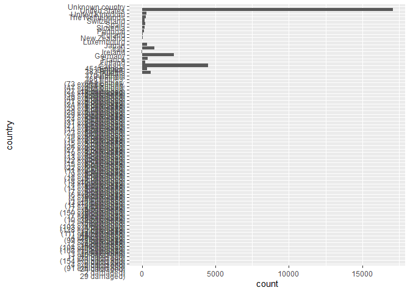

Code-along, Week 05: Big Pumpkins
================
Alex Homer
21 October 2021

``` r
library(tidyverse)
library(ggridges)
```

## Read data

The data are drawn from the “Tidy Tuesday” project: [2021 Week 43: Big
Pumpkins](https://github.com/rfordatascience/tidytuesday/blob/master/data/2021/2021-10-19/readme.md)
(credit:
[BigPumpkins.com](http://www.bigpumpkins.com/ViewArticle.asp?id=132),
providing data from the [Great Pumpkin
Commonwealth](https://gpc1.org/)).

``` r
pumpkins <- read_csv(
  "https://raw.githubusercontent.com/rfordatascience/tidytuesday/master/data/2021/2021-10-19/pumpkins.csv"
)
```

## Which countries?

``` r
pumpkins %>%
  ggplot(aes(y = country)) +
  geom_bar()
```

<!-- -->

``` r
pumpkins_cleaned <- pumpkins %>%
  filter(!str_detect(country, "^\\d")) %>%
  mutate(
    country = case_when(
      country == "Unknown country" ~ NA_character_,
      country == "The Netherlands" ~ "Netherlands",
      TRUE                         ~ country
    ),
    weight_lbs = parse_number(weight_lbs)
  ) 

pumpkins_cleaned %>%
  filter(!is.na(country)) %>%
  mutate(
    country = country %>%
      fct_infreq() %>%
      fct_rev()
  ) %>%
  ggplot(aes(y = country)) +
  geom_bar()
```

<!-- -->

## Which states?

``` r
pumpkins_usa <- pumpkins_cleaned %>%
  filter(country == "United States")

pumpkins_usa %>%
  mutate(
    state_prov = state_prov %>%
      fct_infreq() %>%
      fct_lump_n(n = 21) %>%
      fct_rev()
  ) %>%
  ggplot(aes(y = state_prov)) +
  geom_bar()
```

<!-- -->

``` r
large_states <- pumpkins_usa %>%
  group_by(state_prov) %>%
  summarise(
    mean_wt = mean(weight_lbs, na.rm = TRUE),
    n = n()
  ) %>%
  filter(n >= 50) %>%
  pull(state_prov)

pumpkins_usa %>%
  filter(state_prov %in% large_states) %>%
  mutate(
    state_prov = state_prov %>%
      fct_reorder(weight_lbs, mean)
  ) %>%
  ggplot(aes(x = weight_lbs, y = state_prov)) +
  geom_density_ridges(alpha = 0.7)
```

    ## Picking joint bandwidth of 123

<!-- -->
